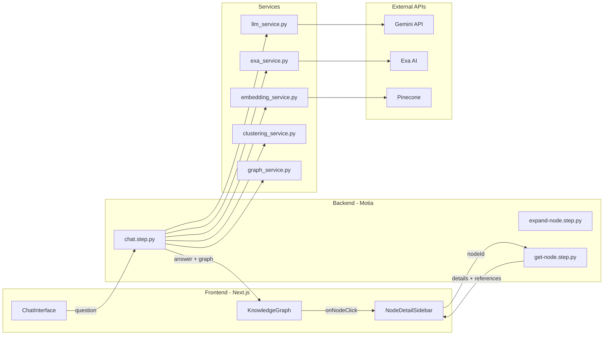
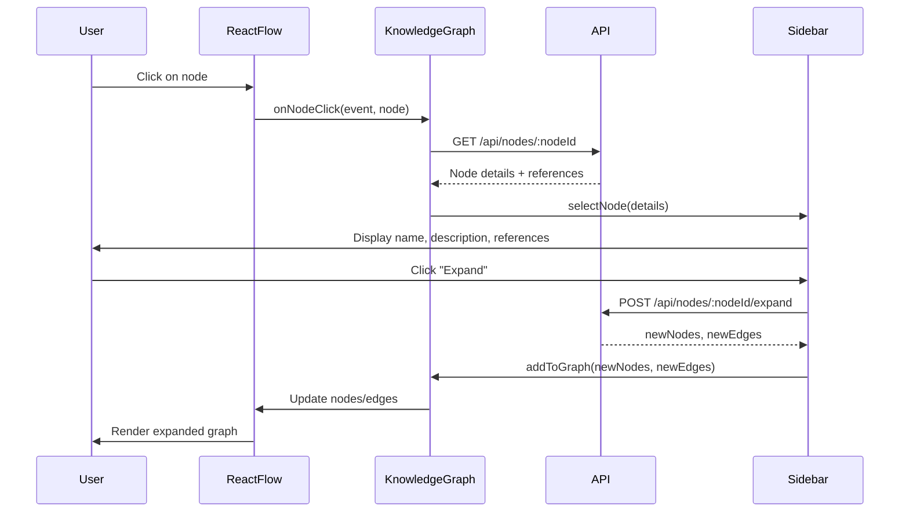

# Knowledge Graph Chatbot Implementation Plan (Updated)

## Architecture Overview




## User Interaction Flow

1. User types question in ChatInterface
2. Backend processes: LLM answer -> extract concepts -> Exa search -> embed -> cluster -> build graph
3. Frontend renders graph with React Flow
4. User clicks a node -> Sidebar opens with:

- Node name and description
- Full article excerpt
- Source references (URLs from Exa AI)
- Related concepts list
- "Expand" button to fetch more connections

## Project Structure

```javascript
hack/
├── src/                              # Motia backend
│   ├── api/
│   │   ├── chat_step.py              # POST /api/chat - main question endpoint
│   │   ├── expand_node_step.py       # POST /api/nodes/:nodeId/expand
│   │   └── get_node_step.py          # GET /api/nodes/:nodeId - node details
│   ├── services/
│   │   ├── llm_service.py            # Gemini LLM wrapper
│   │   ├── embedding_service.py      # Gemini Embeddings + Pinecone
│   │   ├── exa_service.py            # Exa AI search
│   │   ├── clustering_service.py     # HDBSCAN clustering
│   │   └── graph_service.py          # NetworkX graph builder
│   └── utils/
│       └── types.py                  # Pydantic models
├── frontend/                         # Next.js app
│   ├── src/
│   │   ├── app/
│   │   │   ├── page.tsx              # Main page with 3-column layout
│   │   │   ├── layout.tsx            # Chakra UI provider
│   │   │   └── providers.tsx         # Context providers
│   │   ├── components/
│   │   │   ├── ChatInterface.tsx     # Question input + messages
│   │   │   ├── KnowledgeGraph.tsx    # React Flow wrapper
│   │   │   ├── ConceptNode.tsx       # Custom React Flow node
│   │   │   ├── ClusterBackground.tsx # Visual cluster grouping
│   │   │   └── NodeDetailSidebar.tsx # Node info + references panel
│   │   ├── contexts/
│   │   │   └── GraphContext.tsx      # Graph state with Context API
│   │   ├── hooks/
│   │   │   ├── useGraph.ts           # Graph state hook
│   │   │   └── useChat.ts            # Chat state hook
│   │   ├── services/
│   │   │   └── api.ts                # Backend API client
│   │   └── types/
│   │       └── index.ts              # TypeScript interfaces
│   ├── package.json
│   └── next.config.mjs
├── requirements.txt
├── pyproject.toml
└── motia.config.ts
```

---

## Phase 1: Backend Services

### 1.1 Python Dependencies

Update [pyproject.toml](pyproject.toml):

```toml
[project]
dependencies = [
    "pydantic>=2.12.5",
    "google-generativeai>=0.8.0",
    "pinecone-client>=3.0.0",
    "exa-py>=1.0.0",
    "scikit-learn>=1.3.0",
    "networkx>=3.0",
    "numpy>=1.24.0",
]
```


### 1.2 LLM Service (Gemini)

**File**: `src/services/llm_service.py`Key implementation:

- Use `google.generativeai` library
- Model: `gemini-1.5-flash` or `gemini-1.5-pro`
- Functions:
- `generate_answer(question: str, context: dict) -> str`
- `extract_concepts(question: str, answer: str) -> list[dict]` - Returns structured JSON
```python
import google.generativeai as genai
import json

genai.configure(api_key=os.environ["GEMINI_API_KEY"])
model = genai.GenerativeModel("gemini-1.5-flash")

async def extract_concepts(question: str, answer: str) -> list[dict]:
    prompt = f"""Extract key concepts from this Q&A. Return JSON array:
    [{"name": "concept name", "type": "concept|entity|event|person", "description": "brief description"}]
    
    Question: {question}
    Answer: {answer}
    """
    response = model.generate_content(prompt)
    return json.loads(response.text)
```


### 1.3 Embedding Service (Gemini + Pinecone)

**File**: `src/services/embedding_service.py`Key implementation:

- Use `genai.embed_content()` with model `models/text-embedding-004`
- Embedding dimension: 768
- Store in Pinecone for similarity search
```python
import google.generativeai as genai
from pinecone import Pinecone

async def get_embedding(text: str) -> list[float]:
    result = genai.embed_content(
        model="models/text-embedding-004",
        content=text,
        task_type="retrieval_document"
    )
    return result['embedding']  # 768-dimensional vector
```


### 1.4 Exa AI Search Service

**File**: `src/services/exa_service.py`Key implementation:

- Use `exa-py` library
- Search returns articles with full text content
- Store references (URL, title, published date) for sidebar display
```python
from exa_py import Exa

exa = Exa(api_key=os.environ["EXA_API_KEY"])

async def search(query: str, num_results: int = 5) -> list[dict]:
    response = exa.search_and_contents(
        query,
        type="neural",
        use_autoprompt=True,
        num_results=num_results,
        text=True  # Include full text
    )
    return [{
        "id": r.id,
        "url": r.url,
        "title": r.title,
        "text": r.text,
        "published_date": r.published_date,
        "author": r.author
    } for r in response.results]
```


### 1.5 Clustering Service (HDBSCAN)

**File**: `src/services/clustering_service.py`Key implementation:

- scikit-learn 1.3+ includes HDBSCAN: `from sklearn.cluster import HDBSCAN`
- Use cosine metric for text embeddings
- Generate cluster labels using LLM
```python
from sklearn.cluster import HDBSCAN
import numpy as np

async def cluster_concepts(embeddings: list[list[float]], concepts: list[dict]) -> list[dict]:
    if len(concepts) < 2:
        return [{"id": "0", "label": "Main", "conceptIds": [c["id"] for c in concepts]}]
    
    embedding_matrix = np.array(embeddings)
    
    clusterer = HDBSCAN(
        min_cluster_size=2,
        metric='cosine',
        cluster_selection_epsilon=0.3
    )
    labels = clusterer.fit_predict(embedding_matrix)
    
    # Group concepts by cluster
    clusters = {}
    for idx, label in enumerate(labels):
        cluster_id = str(label) if label >= 0 else f"noise_{idx}"
        if cluster_id not in clusters:
            clusters[cluster_id] = {"id": cluster_id, "conceptIds": [], "concepts": []}
        clusters[cluster_id]["conceptIds"].append(concepts[idx]["id"])
        clusters[cluster_id]["concepts"].append(concepts[idx])
    
    # Generate cluster labels using LLM
    for cluster in clusters.values():
        cluster["label"] = await generate_cluster_label(cluster["concepts"])
    
    return list(clusters.values())
```


### 1.6 Graph Service (NetworkX)

**File**: `src/services/graph_service.py`Key implementation:

- Build in-memory graph with NetworkX
- Calculate positions using spring layout
- Return JSON-serializable structure for React Flow
```python
import networkx as nx

class GraphService:
    def __init__(self):
        self.graph = nx.Graph()
    
    def build_graph(self, clusters: list[dict], articles: list[dict]) -> dict:
        # Add nodes for each concept
        for cluster in clusters:
            for concept_id in cluster["conceptIds"]:
                concept = self._find_concept(concept_id, articles)
                self.graph.add_node(
                    concept_id,
                    name=concept["name"],
                    description=concept["description"],
                    type=concept["type"],
                    cluster_id=cluster["id"],
                    references=concept.get("references", [])  # Store Exa references
                )
        
        # Add edges based on similarity
        self._add_similarity_edges()
        
        # Calculate positions
        positions = nx.spring_layout(self.graph, k=2, iterations=50)
        
        return self._to_react_flow_format(positions)
    
    def _to_react_flow_format(self, positions: dict) -> dict:
        nodes = []
        for node_id, pos in positions.items():
            data = self.graph.nodes[node_id]
            nodes.append({
                "id": node_id,
                "type": "conceptNode",  # Custom React Flow node type
                "position": {"x": pos[0] * 800, "y": pos[1] * 600},
                "data": {
                    "name": data["name"],
                    "description": data["description"],
                    "nodeType": data["type"],
                    "clusterId": data["cluster_id"],
                    "references": data["references"]
                }
            })
        
        edges = [
            {"id": f"{u}-{v}", "source": u, "target": v, "type": "smoothstep"}
            for u, v in self.graph.edges()
        ]
        
        return {"nodes": nodes, "edges": edges}
```


---

## Phase 2: Motia API Steps

### 2.1 Chat API Step

**File**: `src/api/chat_step.py`

```python
from pydantic import BaseModel

class ChatRequest(BaseModel):
    question: str
    context: dict = {}

class ChatResponse(BaseModel):
    answer: str
    graph: dict
    clusters: list

config = {
    "name": "ChatAPI",
    "type": "api",
    "path": "/api/chat",
    "method": "POST",
    "description": "Process question and return answer with knowledge graph",
    "emits": [],
    "flows": ["knowledge-graph-flow"],
    "bodySchema": ChatRequest.model_json_schema(),
    "responseSchema": {
        200: ChatResponse.model_json_schema()
    }
}

async def handler(req, context):
    question = req.body["question"]
    
    # 1. Generate answer
    answer = await llm_service.generate_answer(question)
    
    # 2. Extract concepts
    concepts = await llm_service.extract_concepts(question, answer)
    
    # 3. Search Exa for each concept
    articles = []
    for concept in concepts:
        search_results = await exa_service.search(concept["name"], num_results=3)
        concept["references"] = search_results  # Attach references to concept
        articles.extend(search_results)
    
    # 4. Generate embeddings
    embeddings = [await embedding_service.get_embedding(c["name"] + " " + c["description"]) 
                  for c in concepts]
    
    # 5. Cluster concepts
    clusters = await clustering_service.cluster_concepts(embeddings, concepts)
    
    # 6. Build graph
    graph = graph_service.build_graph(clusters, concepts)
    
    return {
        "status": 200,
        "body": {
            "answer": answer,
            "graph": graph,
            "clusters": clusters
        }
    }
```


### 2.2 Get Node Details API Step

**File**: `src/api/get_node_step.py`This endpoint returns detailed information for the sidebar when a node is clicked.

```python
config = {
    "name": "GetNodeDetails",
    "type": "api",
    "path": "/api/nodes/:nodeId",
    "method": "GET",
    "description": "Get detailed information about a node for sidebar display",
    "emits": [],
    "flows": ["knowledge-graph-flow"]
}

async def handler(req, context):
    node_id = req.params["nodeId"]
    
    # Retrieve node from graph service (in-memory)
    node = graph_service.get_node(node_id)
    
    if not node:
        return {"status": 404, "body": {"error": "Node not found"}}
    
    # Return full details including references
    return {
        "status": 200,
        "body": {
            "id": node_id,
            "name": node["name"],
            "description": node["description"],
            "type": node["type"],
            "clusterId": node["cluster_id"],
            "references": node["references"],  # URLs, titles, excerpts from Exa
            "relatedNodes": graph_service.get_related_nodes(node_id)
        }
    }
```


### 2.3 Expand Node API Step

**File**: `src/api/expand_node_step.py`

```python
config = {
    "name": "ExpandNode",
    "type": "api",
    "path": "/api/nodes/:nodeId/expand",
    "method": "POST",
    "description": "Expand a node to fetch more related concepts",
    "emits": [],
    "flows": ["knowledge-graph-flow"]
}

async def handler(req, context):
    node_id = req.params["nodeId"]
    node = graph_service.get_node(node_id)
    
    # Search for more related content
    new_results = await exa_service.search(node["name"], num_results=5)
    
    # Extract new concepts
    new_concepts = await llm_service.extract_concepts_from_articles(new_results)
    
    # Add to graph
    new_nodes, new_edges = graph_service.expand_node(node_id, new_concepts)
    
    return {
        "status": 200,
        "body": {
            "newNodes": new_nodes,
            "newEdges": new_edges
        }
    }
```

---

## Phase 3: Frontend Implementation

### 3.1 Initialize Next.js Project

```bash
cd frontend
npx create-next-app@latest . --typescript --tailwind --eslint --app --src-dir
npm install @chakra-ui/react @chakra-ui/next-js @emotion/react @emotion/styled framer-motion
npm install @xyflow/react axios
```

Note: React Flow is now published as `@xyflow/react` (v12+).

### 3.2 TypeScript Types

**File**: `frontend/src/types/index.ts`

```typescript
export interface Reference {
  id: string;
  url: string;
  title: string;
  text: string;
  publishedDate?: string;
  author?: string;
}

export interface NodeData {
  name: string;
  description: string;
  nodeType: 'concept' | 'entity' | 'event' | 'person';
  clusterId: string;
  references: Reference[];
}

export interface GraphNode {
  id: string;
  type: string;
  position: { x: number; y: number };
  data: NodeData;
}

export interface GraphEdge {
  id: string;
  source: string;
  target: string;
  type?: string;
}

export interface Cluster {
  id: string;
  label: string;
  conceptIds: string[];
}

export interface GraphData {
  nodes: GraphNode[];
  edges: GraphEdge[];
  clusters?: Cluster[];
}

export interface ChatMessage {
  role: 'user' | 'assistant';
  content: string;
}

export interface SelectedNodeDetails {
  id: string;
  name: string;
  description: string;
  type: string;
  references: Reference[];
  relatedNodes: { id: string; name: string }[];
}
```


### 3.3 Graph Context (State Management)

**File**: `frontend/src/contexts/GraphContext.tsx`

```typescript
'use client';
import { createContext, useContext, useState, ReactNode } from 'react';
import { GraphData, SelectedNodeDetails } from '@/types';

interface GraphContextType {
  graph: GraphData | null;
  selectedNode: SelectedNodeDetails | null;
  isSidebarOpen: boolean;
  setGraph: (graph: GraphData) => void;
  selectNode: (node: SelectedNodeDetails | null) => void;
  addToGraph: (newNodes: GraphNode[], newEdges: GraphEdge[]) => void;
  clearGraph: () => void;
}

const GraphContext = createContext<GraphContextType | undefined>(undefined);

export function GraphProvider({ children }: { children: ReactNode }) {
  const [graph, setGraph] = useState<GraphData | null>(null);
  const [selectedNode, setSelectedNode] = useState<SelectedNodeDetails | null>(null);
  
  const selectNode = (node: SelectedNodeDetails | null) => {
    setSelectedNode(node);
  };
  
  const addToGraph = (newNodes: GraphNode[], newEdges: GraphEdge[]) => {
    if (!graph) return;
    setGraph({
      ...graph,
      nodes: [...graph.nodes, ...newNodes],
      edges: [...graph.edges, ...newEdges]
    });
  };
  
  const clearGraph = () => {
    setGraph(null);
    setSelectedNode(null);
  };
  
  return (
    <GraphContext.Provider value={{
      graph,
      selectedNode,
      isSidebarOpen: selectedNode !== null,
      setGraph,
      selectNode,
      addToGraph,
      clearGraph
    }}>
      {children}
    </GraphContext.Provider>
  );
}

export const useGraph = () => {
  const context = useContext(GraphContext);
  if (!context) throw new Error('useGraph must be used within GraphProvider');
  return context;
};
```


### 3.4 Main Page Layout

**File**: `frontend/src/app/page.tsx`Three-column layout: Chat | Graph | Sidebar (conditional)

```typescript
'use client';
import { Box, Flex } from '@chakra-ui/react';
import { ChatInterface } from '@/components/ChatInterface';
import { KnowledgeGraph } from '@/components/KnowledgeGraph';
import { NodeDetailSidebar } from '@/components/NodeDetailSidebar';
import { useGraph } from '@/contexts/GraphContext';

export default function Home() {
  const { isSidebarOpen } = useGraph();
  
  return (
    <Flex h="100vh" overflow="hidden">
      {/* Chat Panel - Fixed width */}
      <Box w="350px" borderRight="1px" borderColor="gray.200" p={4}>
        <ChatInterface />
      </Box>
      
      {/* Graph Panel - Flexible width */}
      <Box flex={1} position="relative">
        <KnowledgeGraph />
      </Box>
      
      {/* Sidebar - Conditional render */}
      {isSidebarOpen && (
        <Box w="400px" borderLeft="1px" borderColor="gray.200">
          <NodeDetailSidebar />
        </Box>
      )}
    </Flex>
  );
}
```


### 3.5 Knowledge Graph Component (React Flow)

**File**: `frontend/src/components/KnowledgeGraph.tsx`Key features:

- Uses `@xyflow/react` (React Flow v12+)
- `onNodeClick` handler to open sidebar
- Dynamic import to avoid SSR issues
- Custom node type registration
```typescript
'use client';
import { useCallback } from 'react';
import {
  ReactFlow,
  Background,
  Controls,
  MiniMap,
  useNodesState,
  useEdgesState,
  Node,
  NodeMouseHandler
} from '@xyflow/react';
import '@xyflow/react/dist/style.css';
import { useGraph } from '@/contexts/GraphContext';
import { ConceptNode } from './ConceptNode';
import { api } from '@/services/api';

const nodeTypes = {
  conceptNode: ConceptNode
};

export function KnowledgeGraph() {
  const { graph, selectNode } = useGraph();
  const [nodes, setNodes, onNodesChange] = useNodesState(graph?.nodes || []);
  const [edges, setEdges, onEdgesChange] = useEdgesState(graph?.edges || []);
  
  // Handle node click - fetch details and open sidebar
  const onNodeClick: NodeMouseHandler = useCallback(async (event, node) => {
    try {
      const details = await api.getNodeDetails(node.id);
      selectNode(details);
    } catch (error) {
      console.error('Failed to fetch node details:', error);
    }
  }, [selectNode]);
  
  return (
    <ReactFlow
      nodes={nodes}
      edges={edges}
      onNodesChange={onNodesChange}
      onEdgesChange={onEdgesChange}
      onNodeClick={onNodeClick}
      nodeTypes={nodeTypes}
      fitView
      minZoom={0.1}
      maxZoom={2}
    >
      <Background />
      <Controls />
      <MiniMap />
    </ReactFlow>
  );
}
```


### 3.6 Custom Concept Node Component

**File**: `frontend/src/components/ConceptNode.tsx`

```typescript
import { memo } from 'react';
import { Handle, Position, NodeProps } from '@xyflow/react';
import { Box, Text, Badge } from '@chakra-ui/react';
import { NodeData } from '@/types';

const nodeColors: Record<string, string> = {
  concept: 'blue.100',
  entity: 'green.100',
  event: 'orange.100',
  person: 'purple.100'
};

export const ConceptNode = memo(({ data, selected }: NodeProps<NodeData>) => {
  return (
    <Box
      px={4}
      py={3}
      bg={nodeColors[data.nodeType] || 'gray.100'}
      border="2px"
      borderColor={selected ? 'blue.500' : 'gray.300'}
      borderRadius="lg"
      boxShadow={selected ? 'lg' : 'md'}
      minW="150px"
      maxW="250px"
      cursor="pointer"
      _hover={{ borderColor: 'blue.400', boxShadow: 'lg' }}
      transition="all 0.2s"
    >
      <Handle type="target" position={Position.Top} />
      
      <Badge colorScheme={data.nodeType === 'concept' ? 'blue' : 'green'} mb={1}>
        {data.nodeType}
      </Badge>
      <Text fontWeight="bold" fontSize="sm" noOfLines={2}>
        {data.name}
      </Text>
      <Text fontSize="xs" color="gray.600" noOfLines={2} mt={1}>
        {data.description}
      </Text>
      
      <Handle type="source" position={Position.Bottom} />
    </Box>
  );
});

ConceptNode.displayName = 'ConceptNode';
```


### 3.7 Node Detail Sidebar with References

**File**: `frontend/src/components/NodeDetailSidebar.tsx`This is the key component that displays node details and references when a node is clicked.

```typescript
'use client';
import {
  Box,
  VStack,
  HStack,
  Text,
  Heading,
  Badge,
  Link,
  Button,
  IconButton,
  Divider,
  Accordion,
  AccordionItem,
  AccordionButton,
  AccordionPanel,
  AccordionIcon,
  Spinner
} from '@chakra-ui/react';
import { CloseIcon, ExternalLinkIcon, AddIcon } from '@chakra-ui/icons';
import { useGraph } from '@/contexts/GraphContext';
import { api } from '@/services/api';
import { useState } from 'react';

export function NodeDetailSidebar() {
  const { selectedNode, selectNode, addToGraph } = useGraph();
  const [isExpanding, setIsExpanding] = useState(false);
  
  if (!selectedNode) return null;
  
  const handleClose = () => selectNode(null);
  
  const handleExpand = async () => {
    setIsExpanding(true);
    try {
      const { newNodes, newEdges } = await api.expandNode(selectedNode.id);
      addToGraph(newNodes, newEdges);
    } catch (error) {
      console.error('Failed to expand node:', error);
    } finally {
      setIsExpanding(false);
    }
  };
  
  return (
    <Box h="100vh" overflowY="auto" p={4} bg="white">
      {/* Header */}
      <HStack justify="space-between" mb={4}>
        <Heading size="md" noOfLines={2}>{selectedNode.name}</Heading>
        <IconButton
          aria-label="Close sidebar"
          icon={<CloseIcon />}
          size="sm"
          onClick={handleClose}
        />
      </HStack>
      
      {/* Type Badge */}
      <Badge colorScheme="blue" mb={4}>{selectedNode.type}</Badge>
      
      {/* Description */}
      <Text fontSize="sm" color="gray.700" mb={4}>
        {selectedNode.description}
      </Text>
      
      <Divider my={4} />
      
      {/* References Section */}
      <Heading size="sm" mb={3}>References ({selectedNode.references.length})</Heading>
      
      <Accordion allowMultiple>
        {selectedNode.references.map((ref, index) => (
          <AccordionItem key={ref.id || index}>
            <AccordionButton>
              <Box flex="1" textAlign="left">
                <Text fontSize="sm" fontWeight="medium" noOfLines={2}>
                  {ref.title}
                </Text>
                <Text fontSize="xs" color="gray.500">
                  {ref.publishedDate ? new Date(ref.publishedDate).toLocaleDateString() : 'No date'}
                </Text>
              </Box>
              <AccordionIcon />
            </AccordionButton>
            <AccordionPanel pb={4}>
              {/* Article Excerpt */}
              <Text fontSize="sm" color="gray.600" mb={3} noOfLines={6}>
                {ref.text?.substring(0, 500)}...
              </Text>
              
              {/* Source Link */}
              <Link href={ref.url} isExternal color="blue.500" fontSize="sm">
                View Source <ExternalLinkIcon mx="2px" />
              </Link>
              
              {ref.author && (
                <Text fontSize="xs" color="gray.500" mt={1}>
                  By {ref.author}
                </Text>
              )}
            </AccordionPanel>
          </AccordionItem>
        ))}
      </Accordion>
      
      {selectedNode.references.length === 0 && (
        <Text fontSize="sm" color="gray.500" fontStyle="italic">
          No references available
        </Text>
      )}
      
      <Divider my={4} />
      
      {/* Related Nodes */}
      <Heading size="sm" mb={3}>Related Concepts</Heading>
      <VStack align="stretch" spacing={2}>
        {selectedNode.relatedNodes.map((related) => (
          <Button
            key={related.id}
            size="sm"
            variant="ghost"
            justifyContent="flex-start"
            onClick={async () => {
              const details = await api.getNodeDetails(related.id);
              selectNode(details);
            }}
          >
            {related.name}
          </Button>
        ))}
      </VStack>
      
      <Divider my={4} />
      
      {/* Expand Button */}
      <Button
        leftIcon={isExpanding ? <Spinner size="sm" /> : <AddIcon />}
        colorScheme="blue"
        w="full"
        onClick={handleExpand}
        isDisabled={isExpanding}
      >
        {isExpanding ? 'Expanding...' : 'Expand & Find More'}
      </Button>
    </Box>
  );
}
```


### 3.8 API Client Service

**File**: `frontend/src/services/api.ts`

```typescript
import axios from 'axios';
import { GraphData, SelectedNodeDetails, ChatMessage } from '@/types';

const client = axios.create({
  baseURL: process.env.NEXT_PUBLIC_API_URL || 'http://localhost:3000'
});

export const api = {
  async chat(question: string): Promise<{ answer: string; graph: GraphData }> {
    const response = await client.post('/api/chat', { question });
    return response.data;
  },
  
  async getNodeDetails(nodeId: string): Promise<SelectedNodeDetails> {
    const response = await client.get(`/api/nodes/${nodeId}`);
    return response.data;
  },
  
  async expandNode(nodeId: string): Promise<{ newNodes: any[]; newEdges: any[] }> {
    const response = await client.post(`/api/nodes/${nodeId}/expand`);
    return response.data;
  }
};
```

---

## Phase 4: Environment Configuration

### Backend Environment Variables

Create `.env` file in project root:

```javascript
GEMINI_API_KEY=your_gemini_api_key
PINECONE_API_KEY=your_pinecone_api_key
PINECONE_ENVIRONMENT=your_pinecone_environment
PINECONE_INDEX=knowledge-graph
EXA_API_KEY=your_exa_api_key
```


### Frontend Environment Variables

Create `frontend/.env.local`:

```javascript
NEXT_PUBLIC_API_URL=http://localhost:3000
```

---

## Data Flow Diagram: Node Click to Sidebar



---

## Key Implementation Notes

1. **React Flow v12+**: Import from `@xyflow/react`, not `react-flow-renderer`
2. **HDBSCAN in scikit-learn**: Available since v1.3.0 via `from sklearn.cluster import HDBSCAN`
3. **Gemini Embeddings**: Use `models/text-embedding-004` which produces 768-dimensional vectors
4. **Exa AI Search**: Returns full article text which is stored as references for sidebar display
5. **Dynamic Import for React Flow**: Use Next.js dynamic imports to avoid SSR issues:
   ```typescript
                  import dynamic from 'next/dynamic';
                  const KnowledgeGraph = dynamic(() => import('@/components/KnowledgeGraph'), { ssr: false });
   ```


6. **Graph Persistence**: Store graph in React Context, not component state, to share across components

---

## Testing Checklist

1. Ask question → Graph appears with clustered nodes
2. Click node → Sidebar opens with name, description