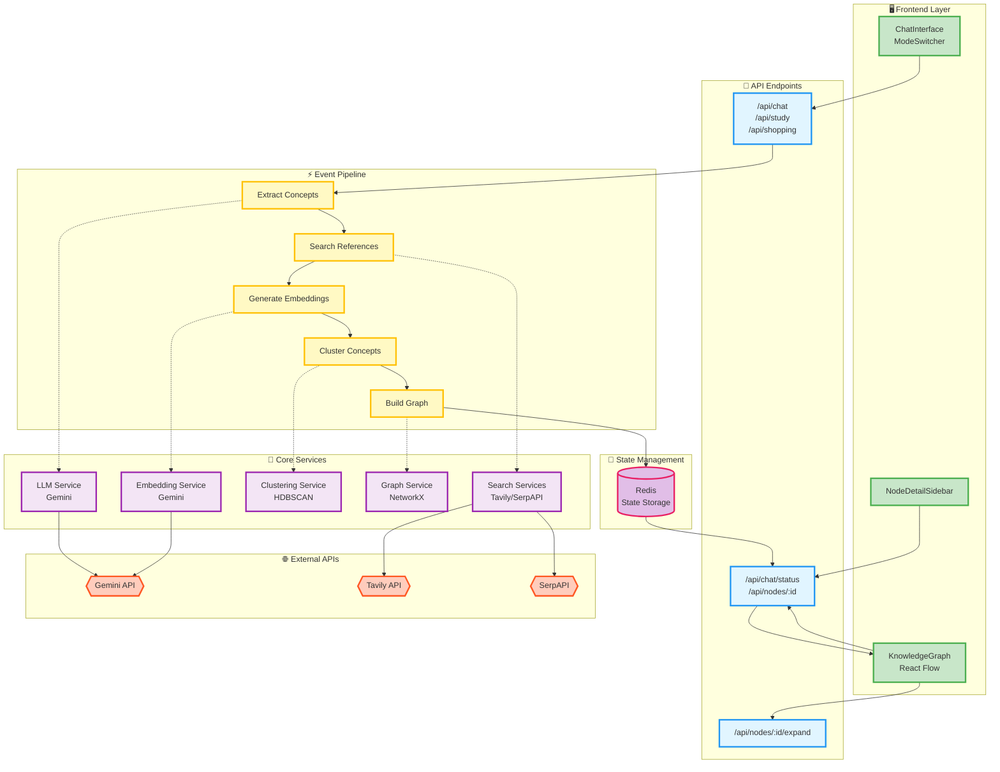

# Dive - Search Redefined

**Dive** is an AI-powered knowledge graph that clusters search results into an interactive graph and links each concept to source references. Clustering groups related concepts visually, so users see thematic relationships instead of a flat list. Each node shows clickable source links with article excerpts, enabling verification of AI claims. Unlike Google AI Overview or Gemini UI, where sources are hidden or unclear, DiveSearch shows which sources support each concept—click any node to see references and verify claims. This provides AI insights with full source attribution, making it easier to verify and explore deeper.

### Dive is a concept showing how search could be redefined in the future of AI, just like how Motia is doing the same for backend development😝

## Table of Contents

- [Overview](#overview)
- [Key Features](#key-features)
- [Architecture](#architecture)
- [Installation](#installation)
- [Configuration](#configuration)
- [Usage](#usage)
- [API Documentation](#api-documentation)
- [Project Structure](#project-structure)
- [Development](#development)
- [Deployment](#deployment)
- [Technology Stack](#technology-stack)
- [Contributing](#contributing)
- [License](#license)

## Overview

Dive transforms traditional search results into an interactive knowledge graph where:

- **Concepts are clustered** by semantic similarity using HDBSCAN clustering
- **Relationships are visualized** through an interactive graph powered by React Flow
- **Sources are transparent** - every concept node links to original articles with excerpts
- **Users can verify** AI-generated summaries by clicking nodes to see supporting references

### Why Dive?

| Feature | Google Search | Google AI Overview | Gemini UI | **Dive** |
|---------|--------------|-------------------|-----------|---------------|
| **Source visibility** | ✅ Links shown | ❌ Sources hidden | ❌ No sources | ✅ **Every concept shows sources** |
| **Visual organization** | ❌ Linear list | ❌ Text summary | ❌ Chat | ✅ **Interactive graph** |
| **Concept relationships** | ❌ None | ❌ None | ❌ None | ✅ **Clustered & connected** |
| **Trust & verification** | ✅ Can verify | ❌ Can't verify | ❌ Can't verify | ✅ **Click node → see sources** |

## Key Features

### 1. Semantic Clustering
- **HDBSCAN clustering** groups related concepts by semantic similarity
- **Adaptive cluster sizes** based on dataset size
- **LLM-generated cluster labels** for intuitive grouping

### 2. Interactive Knowledge Graph
- **React Flow visualization** with drag-and-drop nodes
- **K-nearest neighbor connections** based on embedding similarity
- **Node expansion** to discover related concepts
- **Real-time graph updates** as you explore

### 3. Source Attribution
- **Clickable references** on every concept node
- **Article excerpts** for quick verification
- **Author and publication date** metadata
- **Direct links** to original sources

### 4. Multi-Mode Support
- **Knowledge Graph Mode**: General knowledge exploration
- **Shopping Mode**: Product search with specifications
- **Study Mode**: Learning paths with difficulty levels and prerequisites

### 5. AI-Powered Processing
- **Gemini LLM** for concept extraction and summaries
- **Gemini Embeddings** for semantic similarity
- **Tavily API** for reference search
- **NetworkX** for graph construction

## Architecture


### Motia WorkFlow


### Event Flow

1. **User submits query** → Chat API receives request
2. **LLM processes query** → Extracts key concepts
3. **Search references** → Tavily API finds relevant articles
4. **Generate embeddings** → Gemini creates vector embeddings
5. **Cluster concepts** → HDBSCAN groups similar concepts
6. **Build graph** → NetworkX constructs knowledge graph
7. **Visualize** → React Flow renders interactive graph
8. **User explores** → Click nodes to see sources and details

## Installation

### Prerequisites

- **Node.js** 18+ and npm
- **Python** 3.11+ (or version specified in `.python-version`)
- **Redis** (or use embedded Redis memory server)

### Step 1: Clone the Repository

```bash
git clone <repository-url>
cd motia-hack
```

### Step 2: Install Dependencies

```bash
# Install Node.js dependencies
npm install

# Python dependencies are installed automatically via motia install
# Or manually install:
pip install -r requirements.txt
```

### Step 3: Environment Variables

Create a `.env` file in the root directory:

```env
# Gemini API
GEMINI_API_KEY=your-gemini-api-key

# Tavily API (for reference search)
TAVILY_API_KEY=your-tavily-api-key

# SerpAPI (for shopping mode)
SERPAPI_API_KEY=your-serpapi-key

# Redis Configuration (if using external Redis)
REDIS_HOST=localhost
REDIS_PORT=6379
REDIS_PASSWORD=
REDIS_USERNAME=
REDIS_DB=0

# Frontend API URL
NEXT_PUBLIC_API_URL=http://localhost:3000
```

### Step 4: Start Development Server

```bash
npm run dev
```

The application will be available at:
- **Frontend**: `http://localhost:3000`
- **Motia Workbench**: `http://localhost:3000` (workbench UI)

## Configuration

### Motia Configuration

Edit `motia.config.ts` to configure Redis and plugins:

```typescript
import { config } from 'motia'

export default config({
  plugins: [],
  redis: {
    useMemoryServer: false, // Set to true for embedded Redis
    host: process.env.REDIS_HOST || 'localhost',
    port: parseInt(process.env.REDIS_PORT || '6379'),
    password: process.env.REDIS_PASSWORD,
    username: process.env.REDIS_USERNAME,
    db: parseInt(process.env.REDIS_DB || '0'),
  },
})
```

### Frontend Configuration

Edit `frontend/next.config.mjs` for Next.js settings:

```javascript
const nextConfig = {
  // Your Next.js configuration
}
```

## Usage

### Basic Query

1. Open the application at `http://localhost:3000`
2. Type your question in the chat interface
3. Wait for the knowledge graph to generate
4. Click on any node to see detailed information and sources

### Example Queries

**Knowledge Graph Mode:**
- "What is quantum computing?"
- "Explain machine learning algorithms"
- "How does photosynthesis work?"

**Shopping Mode:**
- "Best laptops under $1000"
- "Wireless headphones with noise cancellation"
- "Gaming keyboards with RGB"

**Study Mode:**
- "Learn Python programming"
- "Understanding neural networks"
- "Introduction to data structures"

### Node Interaction

- **Click a node**: Opens sidebar with details and sources
- **Expand node**: Discovers related concepts
- **Filter by cluster**: Use filters to focus on specific topics
- **View learning path**: In study mode, see the recommended sequence

## API Documentation

### Chat API

**Endpoint:** `POST /api/chat`

**Request Body:**
```json
{
  "question": "What is quantum computing?",
  "mode": "default",
  "image": "base64-encoded-image (optional)",
  "previousQuery": "previous question (optional)"
}
```

**Response:**
```json
{
  "requestId": "uuid",
  "answer": "AI-generated answer",
  "status": "processing"
}
```

### Get Chat Status

**Endpoint:** `GET /api/chat/status/:requestId`

**Response:**
```json
{
  "status": "completed",
  "graph": {
    "nodes": [...],
    "edges": [...]
  },
  "clusters": [...]
}
```

### Get Node Details

**Endpoint:** `GET /api/nodes/:nodeId`

**Response:**
```json
{
  "id": "node-id",
  "name": "Concept Name",
  "description": "Detailed description",
  "references": [
    {
      "id": "ref-id",
      "url": "https://example.com/article",
      "title": "Article Title",
      "text": "Article excerpt...",
      "publishedDate": "2024-01-01",
      "author": "Author Name"
    }
  ],
  "relatedNodes": [...]
}
```

### Expand Node

**Endpoint:** `POST /api/nodes/:nodeId/expand`

**Response:**
```json
{
  "requestId": "uuid",
  "status": "processing"
}
```

### Study Mode APIs

**Build Learning Path:**
- `POST /api/study/build-learning-path`
- `POST /api/study/generate-quiz`

**Shopping Mode:**
- `POST /api/shopping`

## Project Structure

```
motia-hack/
├── src/                          # Motia backend
│   ├── api/                      # API endpoints
│   │   ├── chat_step.py          # Main chat endpoint
│   │   ├── chat_status_step.py   # Status polling
│   │   ├── get_node_step.py      # Node details
│   │   ├── expand_node_step.py   # Node expansion
│   │   ├── study_step.py          # Study mode
│   │   ├── shopping_step.py       # Shopping mode
│   │   └── generate_quiz_step.py  # Quiz generation
│   ├── events/                   # Event handlers
│   │   ├── extract_concepts_step.py
│   │   ├── search_references_step.py
│   │   ├── generate_embeddings_step.py
│   │   ├── cluster_concepts_step.py
│   │   ├── build_graph_step.py
│   │   ├── assign_levels_step.py
│   │   └── build_learning_path_step.py
│   ├── services/                 # Business logic
│   │   ├── llm_service.py         # Gemini LLM
│   │   ├── embedding_service.py   # Embeddings
│   │   ├── clustering_service.py  # HDBSCAN clustering
│   │   ├── graph_service.py       # NetworkX graphs
│   │   ├── tavily_service.py      # Reference search
│   │   ├── study_service.py        # Learning paths
│   │   └── product_service.py     # Product search
│   └── utils/                     # Utilities
│       ├── state_keys.py          # State management
│       └── types.py               # Type definitions
├── frontend/                      # Next.js frontend
│   └── src/
│       ├── app/                   # Next.js app router
│       ├── components/            # React components
│       │   ├── ChatInterface.tsx
│       │   ├── KnowledgeGraph.tsx
│       │   ├── NodeDetailSidebar.tsx
│       │   ├── ConceptCard.tsx
│       │   └── ...
│       ├── contexts/              # React contexts
│       │   ├── GraphContext.tsx
│       │   └── ModeContext.tsx
│       ├── services/              # API client
│       │   └── api.ts
│       └── types/                 # TypeScript types
│           └── index.ts
├── middlewares/                   # Motia middlewares
│   └── timing_middleware.py
├── motia.config.ts               # Motia configuration
├── requirements.txt               # Python dependencies
└── package.json                  # Node.js dependencies
```

## Development

### Development Workflow

1. **Start development server:**
   ```bash
   npm run dev
   ```

2. **Make changes** to backend (Python) or frontend (TypeScript)

3. **Hot reload** automatically updates the application

4. **View Workbench** at `http://localhost:3000` to see step execution

### Available Scripts

```bash
# Development
npm run dev              # Start dev server with hot reload
npm run start            # Start production server
npm run generate-types   # Generate TypeScript types from steps

# Build
npm run build            # Build for deployment
npm run clean            # Clean build artifacts
```

### Code Structure

- **Backend Steps**: Python files in `src/api/` and `src/events/`
- **Services**: Business logic in `src/services/`
- **Frontend**: React components in `frontend/src/components/`
- **State Management**: React Context in `frontend/src/contexts/`

### Testing

```bash
# Test API endpoints
curl http://localhost:3000/api/chat -X POST -d '{"question":"test"}'

# Test node details
curl http://localhost:3000/api/nodes/{nodeId}
```

## Deployment

### Build for Production

```bash
npm run build
```

This creates a `dist/` directory with bundled steps.

### Deploy to Motia Cloud

```bash
npx motia cloud deploy \
  --api-key your-api-key \
  --version-name 1.0.0 \
  --project-name divesearch \
  --env-file .env
```

### Environment Variables for Production

Ensure all required environment variables are set in your deployment environment:

- `GEMINI_API_KEY`
- `TAVILY_API_KEY`
- `SERPAPI_API_KEY` (for shopping mode)
- Redis configuration variables

## Technology Stack

### Backend
- **Motia**: Unified backend framework
- **Python 3.11+**: Backend logic
- **Gemini API**: LLM and embeddings
- **Tavily API**: Reference search
- **NetworkX**: Graph construction
- **HDBSCAN**: Clustering algorithm
- **Redis**: State management

### Frontend
- **Next.js 14**: React framework
- **React Flow**: Graph visualization
- **Chakra UI**: Component library
- **TypeScript**: Type safety
- **Axios**: HTTP client

### AI & ML
- **Google Gemini**: Language model and embeddings
- **scikit-learn**: Machine learning utilities
- **NumPy**: Numerical computing

## Contributing

1. Fork the repository
2. Create a feature branch (`git checkout -b feature/amazing-feature`)
3. Commit your changes (`git commit -m 'Add amazing feature'`)
4. Push to the branch (`git push origin feature/amazing-feature`)
5. Open a Pull Request

### Development Guidelines

- Follow Python PEP 8 style guide
- Use TypeScript for frontend code
- Write descriptive commit messages
- Add tests for new features
- Update documentation as needed

## Troubleshooting

### Build Errors

**Python environment not found:**
```bash
npm run clean
npm install
npx motia install
```

**Missing dependencies:**
```bash
pip install -r requirements.txt
```

### Runtime Errors

**Redis connection failed:**
- Check Redis is running
- Verify environment variables
- Or set `useMemoryServer: true` in `motia.config.ts`

**API key errors:**
- Verify all API keys are set in `.env`
- Check API key permissions and quotas

### Frontend Issues

**Graph not rendering:**
- Check browser console for errors
- Verify API endpoint is accessible
- Check network tab for failed requests

## License

[Add your license here]

## Acknowledgments

- Built with [Motia](https://motia.dev)
- Powered by [Google Gemini](https://ai.google.dev)
- Graph visualization with [React Flow](https://reactflow.dev)

## Learn More

- [Motia Documentation](https://motia.dev/docs)
- [Motia Discord Community](https://discord.gg/motia)
- [React Flow Documentation](https://reactflow.dev/docs)
- [Next.js Documentation](https://nextjs.org/docs)
